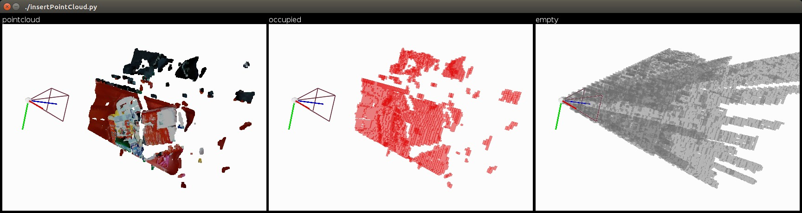

<h1 align="center">octomap_py</h1>
<h4 align="center">Python binding of <a href="https://github.com/OctoMap/octomap">the OctoMap library</a>.</h4>
<div align="center">
  <a href="https://pypi.python.org/pypi/octomap-py"></a>
  <a href="https://pypi.org/project/octomap-py"></a>
</div>

## Installation

### From PyPI
Install `octomap-py` directly from PyPI:
```bash
pip install octomap-py
```

**Prerequisites:**
* Python development headers: `sudo apt-get install python3-dev`
* C++ compiler: `sudo apt-get install build-essential`
* CMake: `sudo apt-get install cmake`

### From Source
Alternatively, clone the repository and install:
```
git clone https://github.com/ethanmclark1/octomap_py.git
cd octomap_py
pip install -e '.[example]'
```

### ROS Humble Integration
To use OctoMap with ROS Humble, you'll need to install the following ROS packages:

```bash
sudo apt-get install ros-humble-octomap ros-humble-octomap-mapping ros-humble-octomap-server
```

These packages provide the necessary ROS integration for OctoMap:
- `ros-humble-octomap`: Core OctoMap library for ROS
- `ros-humble-octomap-mapping`: Provides mapping capabilities using OctoMap
- `ros-humble-octomap-server`: Offers a ROS server for OctoMap, allowing you to save, load, and publish OctoMaps

After installing these packages, you can use OctoMap within your ROS Humble environment.

## Example Usage
Clone the repository, navigate to examples, and run:
```
cd examples
python insertPointCloud.py
```


## Quick API Overview
```python
import octomap
# Create an empty OctoMap
octree = octomap.OcTree(0.1)
# Insert a point cloud
point_cloud = octomap.Pointcloud()
point_cloud.push_back(1.0, 0.0, 0.0)
octree.insertPointCloud(point_cloud, octomap.point3d(0.0, 0.0, 0.0))
# Save and load the map
octree.writeBinary("example_map.bt")
octree.readBinary("example_map.bt")
```

## ROS Humble Usage
When using OctoMap with ROS Humble, you can utilize the installed ROS packages. Here's a basic example of how to use the `octomap_server` node:

```bash
# Run the octomap server
ros2 run octomap_server octomap_server_node

# In another terminal, you can now publish point cloud data to be inserted into the OctoMap
# For example, using a bag file:
ros2 bag play your_pointcloud_bag.bag

# View the OctoMap in RViz
ros2 run rviz2 rviz2
```

Make sure to configure RViz to display the OctoMap by adding an OccupancyGrid or MarkerArray display and setting the appropriate topic.

## Acknowledgement
This is a fork of [wkentaro/octoma-python](https://github.com/wkentaro/octomap_py) which itself is a fork of [neka-nat/python-octomap](https://github.com/neka-nat/python-octomap).

## License

`octomap-py` is licensed under the BSD License. See the [LICENSE](LICENSE) file for details.
